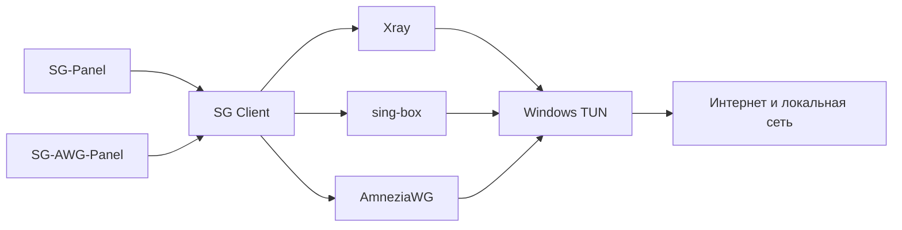

# SG Client

Windows-клиент для профилей, создаваемых **SG-Panel** и **SG-AWG-Panel**.


SG Client тесно связан с панелями SG. Пользователю не нужно отдельно подбирать и настраивать Xray, sing-box или AmneziaWG: клиент определяет тип профиля, выбирает подходящий движок и управляет подключением через единый интерфейс.

> Текущая версия: `095`.


### Новое в сборке 095

- В окне настроек оставлены только две страницы: «Настройки» и «О программе».
- Убраны заголовки и подзаголовки «Основные настройки», «Параметры TUN» и «Дополнительные параметры».
- Все рабочие параметры показываются единым классическим списком карточек.
- UDP, определение типа трафика и локальный журнал соединений Xray всегда включены и больше не показываются как отключаемые параметры.
- Выбор подробности журнала сохранён.
- Сохранены все функции SG Client 089: протоколы, маршрутизация, трафик, подписки, управление из трея и Local Proxy.

### Новое в сборке 082

- SG Client 080 оставлен полной функциональной основой; из 077 не возвращался старый код.
- Значок подключения и сведения о профиле остаются в верхней части сцены.
- Вся сетка TUN / System Proxy / Local Proxy / «Отключить всё» закреплена внизу свободной области прямо над карточкой трафика.
- Карточка трафика и шесть быстрых настроек остаются прижатыми к нижней части основной карточки.
- Сохранены все протоколы, трафик за сеанс/день/месяц/всего, исправленная маршрутизация, резервные копии, GeoFiles, AmneziaWG и диагностика.

## Что делает SG Client

- импортирует ссылки и конфигурации из SG-Panel и SG-AWG-Panel;
- определяет тип профиля и выбирает подходящий движок;
- включает, отключает и переключает TUN;
- показывает фактическое состояние ядра и подключения;
- объединяет маршрутизацию, DNS, локальную сеть, DPI и диагностику в одном интерфейсе;
- поддерживает portable-запуск без установки.



## Поддерживаемые профили

| Профиль | Движок |
|---|---|
| VLESS RAW/TCP + REALITY | Xray |
| VLESS XHTTP + REALITY | Xray |
| VLESS XHTTP + TLS | Xray |
| Hysteria 2 | sing-box |
| AmneziaWG `.conf` | AmneziaWG |

SG Client не задуман как универсальный клиент для любых конфигураций. Проект сосредоточен на профилях и сценариях, которые создают и обслуживают панели SG.

## Интерфейс и логика SG

Пользовательский интерфейс и прикладная SG-логика разработаны заново поверх открытой технической основы:

- единый сценарий управления TUN и переключения профилей;
- собственная система состояний подключения;
- единый стандарт дополнительных окон;
- предварительное сравнение параметров DPI;
- проверка фактически созданного `config.json` после применения;
- интеграция профилей SG-Panel и SG-AWG-Panel;
- встроенная русская справка.

## Основные возможности

### TUN

Главная кнопка выполняет реальное включение и отключение TUN. При переключении профиля текущее подключение сначала завершается, после чего запускается выбранный движок.

### Умная маршрутизация

Для основных категорий доступны действия `Direct`, `VPN` и `Block`. Один набор настроек переводится в конфигурацию Xray или sing-box.

### Маскировка DPI

Окно DPI показывает активную конфигурацию и параметры, которые будут записаны после применения. После успешного запуска результат повторно читается из рабочего `config.json`.

### Раздельный TUN

Можно исключить из туннеля отдельные приложения, IP-адреса и подсети. Возможности зависят от выбранного движка.

### Обновления компонентов

Пользовательская проверка обновлений ограничена реально поставляемыми и безопасно заменяемыми ядрами:

- Xray;
- sing-box.

AmneziaWG обновляется вместе с проверенной сборкой SG Client. Mihomo не входит в пользовательскую проверку обновлений.

## Быстрый запуск

### Требования

- Windows 10 или Windows 11 x64;
- права администратора для управления TUN;
- полностью распакованный portable-архив.

### Запуск

1. Откройте раздел [Releases](https://github.com/s-gor/sg-client-win/releases).
2. Скачайте `SG-CLIENT-095-PORTABLE-x64.zip`.
3. Полностью распакуйте ZIP в отдельную папку.
4. Запустите `SG-Client.exe`.
5. Импортируйте профиль, выберите его и нажмите «Включить TUN».

Не запускайте EXE непосредственно из ZIP-архива.

## Структура portable-пакета

```text
SG-Client.exe
bin/
  xray/
  sing_box/
  awg/
  srss/
README-RU.txt
THIRD-PARTY-NOTICES.md
RESET-KILL-SWITCH.cmd
```

Пользовательские профили, рабочие конфигурации и журналы создаются локально после первого запуска и не входят в release-архив.

## Сборка из исходников

Требуется Windows 10/11 x64 и .NET SDK 10.x.

```cmd
dotnet restore v2rayN\v2rayN.sln
dotnet test v2rayN\ServiceLib.Tests\ServiceLib.Tests.csproj -c Release
dotnet publish v2rayN\v2rayN\v2rayN.csproj -c Release -r win-x64 -p:SelfContained=true -p:EnableWindowsTargeting=true -o artifacts\sg-client
```

Подробности: [docs/06-BUILD.md](docs/06-BUILD.md).

## Документация

- [Быстрый старт](docs/01-QUICK-START.md)
- [Профили и движки](docs/02-PROFILES-AND-ENGINES.md)
- [TUN и маршрутизация](docs/03-TUN-AND-ROUTING.md)
- [Маскировка DPI](docs/04-DPI.md)
- [Диагностика](docs/05-TROUBLESHOOTING.md)
- [Сборка](docs/06-BUILD.md)
- [Проверка релиза](docs/07-RELEASE-CHECKLIST.md)
- [Изменения SG относительно технической основы](SG-UPSTREAM.md)

## Техническая основа

Используются открытые компоненты:

- v2rayN — часть технической инфраструктуры;
- Xray-core;
- sing-box;
- AmneziaWG;
- Wintun;
- GeoIP, GeoSite и rule-set.

Происхождение и лицензии перечислены в [THIRD-PARTY-NOTICES.md](THIRD-PARTY-NOTICES.md).

## Безопасность

Не публикуйте в Issue приватные ключи, UUID действующих профилей, токены, полные конфигурации серверов и неочищенные журналы. См. [SECURITY.md](SECURITY.md).

## Автор

Проект и интерфейс SG Client: **Ser.Gor**.
