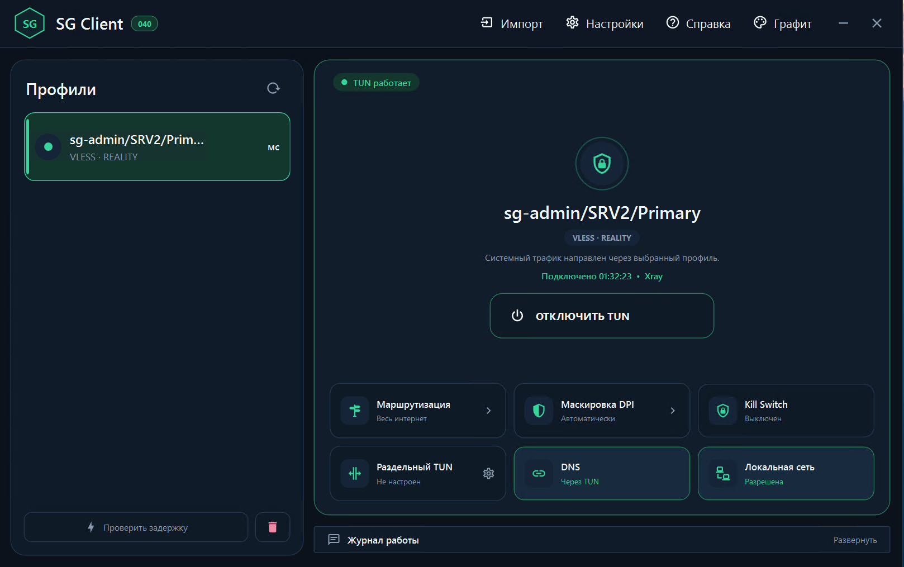
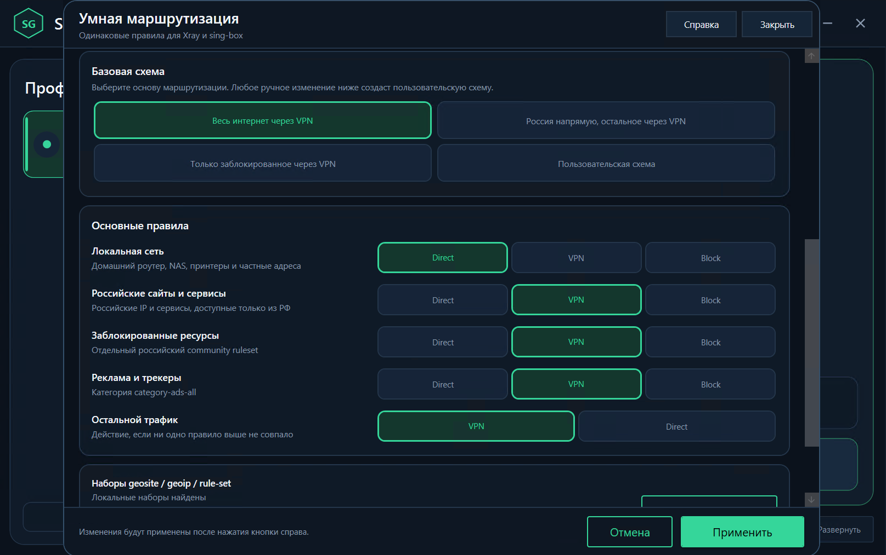
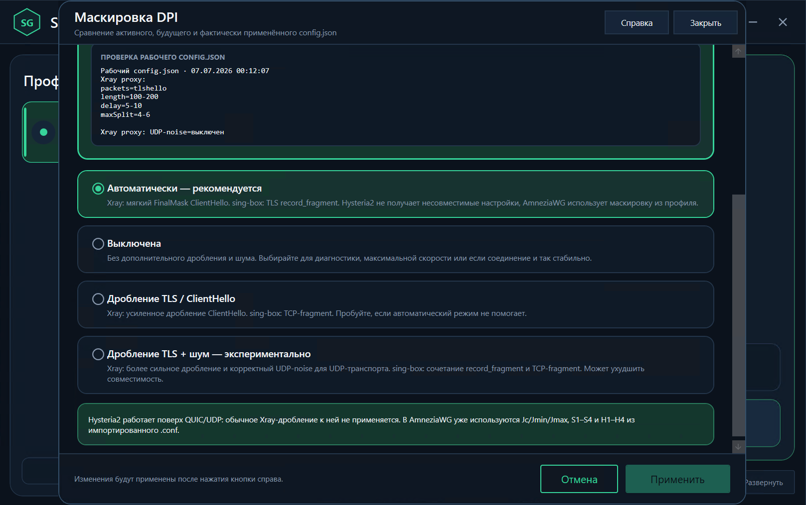
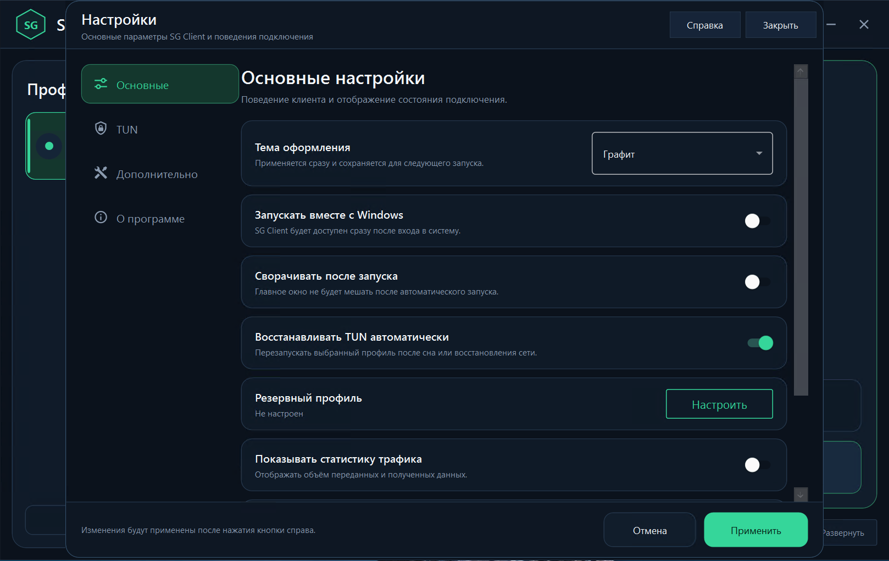

# SG Client

Windows-клиент для профилей, создаваемых **SG-Panel** и **SG-AWG-Panel**.

[](https://github.com/s-gor/sg-client-win/releases/tag/v0.0.40)


> Текущая версия: `v0.0.40`. Официальный формат — компактный Portable ZIP для Windows x64.





## Скачать

### [Скачать SG Client 040 Portable x64](https://github.com/s-gor/sg-client-win/releases/download/v0.0.40/SG-CLIENT-040-PORTABLE-x64.zip)

Дополнительные файлы:

- [исходный код SG Client 040](https://github.com/s-gor/sg-client-win/releases/download/v0.0.40/SG-CLIENT-040-SOURCE.zip);
- [контрольные суммы SHA-256](https://github.com/s-gor/sg-client-win/releases/download/v0.0.40/SHA256SUMS.txt);
- [страница релиза v0.0.40](https://github.com/s-gor/sg-client-win/releases/tag/v0.0.40).

Установочный EXE не используется. Полностью распакуйте ZIP в отдельную папку и запускайте `SG-Client-040.exe` только из распакованной папки.

## Что такое SG Client

SG Client — единый Windows-клиент экосистемы SG. Он принимает ссылки и конфигурации, созданные серверными панелями, выбирает подходящий движок и поднимает системное подключение через TUN.

```text
SG-Panel / SG-AWG-Panel
           |
           | ссылка или конфигурация
           v
      SG Client 040
           |
           +-- Xray --------> VLESS
           +-- sing-box ----> Hysteria2
           +-- AmneziaWG ---> AWG
           |
           v
        Интернет
```

Движки не смешиваются: для каждого профиля используется только соответствующий ему компонент.

## Поддерживаемые профили

| Источник | Профиль | Движок |
|---|---|---|
| SG-Panel | VLESS REALITY, TCP/RAW | Xray |
| SG-Panel | VLESS XHTTP + REALITY | Xray |
| SG-Panel | VLESS XHTTP + TLS | Xray |
| SG-Panel | Hysteria2 + QUIC + TLS | sing-box |
| SG-AWG-Panel | AmneziaWG | AmneziaWG |

Смешанный серверный профиль импортируется как отдельные доступные подключения. Пользователь выбирает то, которое нужно запустить сейчас.

## Быстрый запуск

1. [Скачайте Portable ZIP](https://github.com/s-gor/sg-client-win/releases/download/v0.0.40/SG-CLIENT-040-PORTABLE-x64.zip).
2. Полностью распакуйте архив, например в `D:\Programs\SG-Client-040`.
3. Запустите `SG-Client-040.exe`.
4. Подтвердите запрос Windows на запуск с правами администратора.
5. Импортируйте ссылку из SG-Panel или конфигурацию из SG-AWG-Panel.
6. Выберите профиль и нажмите главную кнопку подключения.
7. Дождитесь состояния «Подключено» и проверьте доступ в интернет.

Не запускайте программу непосредственно из ZIP-архива.

## Как подключить ссылку из SG-Panel

1. В SG-Panel откройте `Clients`.
2. Выберите нужного клиента.
3. Откройте блок ссылок и подписки.
4. Скопируйте прямую ссылку нужного профиля.
5. В SG Client откройте добавление профиля и импорт из буфера обмена.
6. Проверьте имя и тип найденного профиля, затем сохраните его.
7. Выберите профиль и подключитесь.

Для первого теста используйте прямую ссылку. Подписку удобнее подключать после того, как прямое соединение уже проверено.

## Как подключить AmneziaWG

1. В SG-AWG-Panel откройте страницу клиента.
2. Скопируйте полный текст конфигурации или скачайте файл `.conf`.
3. В SG Client выберите импорт AmneziaWG из буфера или из файла.
4. Сохраните профиль, выберите его и подключитесь.

Параметры маскировки AmneziaWG берутся из самой конфигурации.

## Как понять, что подключение работает

Смотрите не только на цвет значка. Надёжная проверка состоит из нескольких признаков:

1. В SG Client отображается состояние **«Подключено»**.
2. Главная кнопка предлагает **отключить**, а не подключить профиль.
3. Выбранный профиль помечен как активный.
4. Счётчики принятого и отправленного трафика меняются.
5. В браузере открываются сайты.
6. При ожидаемой серверной маршрутизации внешний IP отличается от IP без SG Client.
7. В журнале после подключения нет повторяющихся ошибок запуска движка или TUN.

Состояния интерфейса:

| Состояние | Что означает |
|---|---|
| зелёное / «Подключено» | профиль и TUN запущены |
| жёлтое / переходное | выполняется подключение или отключение |
| серое или красное | соединение отключено либо произошла ошибка |

Цвет — вспомогательная подсказка. Окончательный признак — фактическое состояние подключения, работа интернета и отсутствие новых ошибок в журнале.

## Основные функции

### TUN

TUN направляет системный трафик Windows через активный профиль. Главная кнопка SG Client выполняет реальное включение и отключение TUN. При завершении программы клиент сначала отключает TUN, затем закрывается.

### Маршрутизация

SG Client поддерживает системную и раздельную маршрутизацию. В Portable входят GeoIP, GeoSite и SRS-наборы, используемые правилами направления трафика.

### DNS

DNS можно направлять через TUN. Это уменьшает риск обращения к локальному DNS в обход активного подключения. Настройку DNS следует проверять вместе с выбранным режимом маршрутизации.

### Маскировка DPI

Для поддерживаемых Xray-профилей доступны управляемые режимы дробления TLS/ClientHello и экспериментального шума. Для Hysteria2 обычное Xray-дробление не применяется. У AmneziaWG маскировка встроена в профиль.

### Kill Switch

Kill Switch блокирует нежелательный выход трафика при разрыве защищённого соединения. Для аварийного снятия правил в Portable находится `RESET-KILL-SWITCH.cmd`.

### Обновления компонентов

SG Client 040 проверяет пользовательские обновления только для Xray и sing-box. Mihomo исключён. AmneziaWG обновляется вместе со всем SG Client. Самостоятельное обновление SG Client отключено.

## Первый порядок проверки

1. Распаковать Portable.
2. Запустить SG Client с правами администратора.
3. Импортировать один профиль.
4. Подключить его без дополнительных изменений.
5. Проверить состояние, интернет и внешний IP.
6. Отключить профиль и убедиться, что обычный интернет восстановился.
7. Только затем менять DNS, маршрутизацию, DPI или Kill Switch.

## Документация

### Начало работы

- [С чего начать](docs/START-HERE.md)
- [Полное руководство пользователя](docs/USER-GUIDE.md)
- [Portable: скачивание и запуск](docs/PORTABLE.md)

### Профили и подключение

- [Импорт профилей из SG-Panel и SG-AWG-Panel](docs/IMPORT-PROFILES.md)
- [Состояния подключения и проверка работы](docs/CONNECTION-CHECK.md)

### Сеть и защита

- [TUN, DNS и маршрутизация](docs/TUN-ROUTING-DNS.md)
- [Маскировка DPI](docs/DPI.md)
- [Kill Switch и аварийное восстановление](docs/KILL-SWITCH.md)

### Обслуживание

- [Диагностика](docs/DIAGNOSTICS.md)
- [Обновления компонентов](docs/UPDATES.md)
- [Release Notes 040](RELEASE-NOTES-040.md)

## Состав Portable

В официальный пакет входят:

- `SG-Client-040.exe`;
- Xray-core;
- sing-box и `libcronet.dll`;
- AmneziaWG, `awg.exe` и Wintun;
- `geoip.dat`, `geosite.dat` и SRS-наборы;
- обязательные библиотеки .NET/WPF;
- `RESET-KILL-SWITCH.cmd`;
- лицензии и текстовая документация.

Пакет не содержит пользовательских профилей, журналов, рабочего `binConfigs\config.json`, временных файлов и результатов сборки.


## Интерфейс SG Client 040

На снимках показана настоящая рабочая сборка SG Client 040 в теме **«Графит»**.

### Главное окно и состояние TUN

Главное окно показывает активный профиль, используемый движок, время соединения и состояние TUN. Здесь же доступны маршрутизация, маскировка DPI, Kill Switch, DNS, раздельный TUN и доступ к локальной сети.


### Умная маршрутизация

Готовые схемы позволяют направить весь трафик через VPN, вывести российские ресурсы напрямую, отправить через VPN только заблокированные ресурсы либо собрать собственную схему. Для каждой категории можно выбрать `Direct`, `VPN` или `Block`.



### Маскировка DPI

Режим «Автоматически» выбирает совместимые настройки для текущего движка. Дополнительно доступны отключение маскировки, дробление TLS/ClientHello и экспериментальный режим дробления с шумом. В верхней части окна показывается фактически применённая конфигурация.



### Настройки и тема оформления

В настройках находятся запуск вместе с Windows, автоматическое восстановление TUN, резервный профиль, статистика трафика, параметры TUN и дополнительные возможности. Тема оформления применяется сразу и сохраняется для следующего запуска.



## Требования

- Windows 10 или Windows 11 x64;
- права администратора для TUN, маршрутов и Kill Switch;
- полная распаковка Portable;
- профиль, созданный SG-Panel или SG-AWG-Panel.

## Лицензии

Проект использует Xray-core, sing-box, AmneziaWG, Wintun, инфраструктуру на основе v2rayN и открытые базы маршрутизации. Уведомления и лицензии находятся в `LICENSE` и `THIRD-PARTY-NOTICES.md`.

## Ответственность

Используйте SG Client в соответствии с законодательством своей страны, правилами сети и условиями провайдера. Перед включением Kill Switch убедитесь, что знаете способ аварийного восстановления.

Проект: **Ser.Gor**.
