# SG-Client v0.95

**SG-Client** — универсальный VPN-клиент для Windows, работающий с совместимыми профилями и подписками из разных источников. Он не привязан только к SG-Panel или SG-AWG-Panel: можно использовать собственные серверы, обычные ссылки и сторонние подписки. Наиболее полная интеграция доступна с SG-Panel и SG-AWG-Panel.

[Скачать последнюю Portable-версию](../../releases/latest)

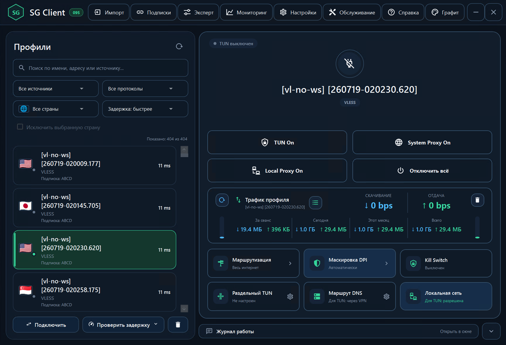

## Совместимость

SG-Client принимает совместимые профили, обычные ссылки и подписки из разных источников. Клиент подходит для собственных серверов и сторонних сервисов. SG-Panel и SG-AWG-Panel дают наиболее полную готовую интеграцию, но не являются обязательным условием использования.

## Главное в версии v0.95

- три отдельных режима: **TUN**, **System Proxy** и **Local Proxy**;
- цветовая индикация активного режима и понятное состояние кнопок;
- полное управление из **системного трея** без открытия главного окна;
- мониторинг фактических направлений **VPN / Direct / Block**;
- статистика трафика по каждому профилю за сеанс, день, месяц и всё время;
- текущая скорость в `bps`, `kbps`, `Mbps` и `Gbps`;
- поиск, фильтры, страны и проверка задержки для больших подписок;
- единая маршрутизация для Xray и sing-box;
- управление GeoFiles с проверкой источника, SHA-256 и резервным откатом;
- безопасное обновление подписок напрямую или через VPN;
- резервные копии, проверка ZIP и восстановление со страховочной копией;
- проверяемое обновление Xray с контролем версии, SHA-256 и текущего `config.json`;
- встроенная подробная справка.

## Три режима подключения

### TUN

Системный трафик направляется через выбранный профиль. Активное состояние выделяется зелёным.

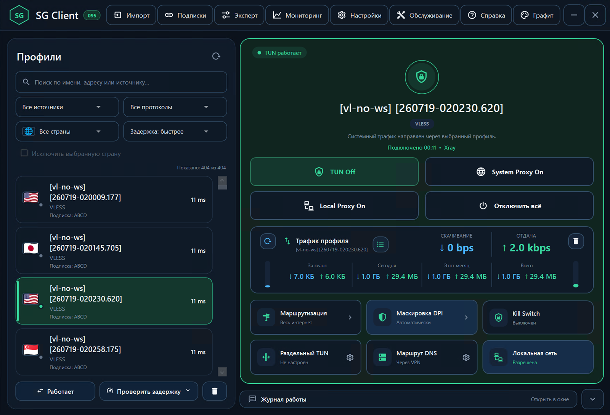

### System Proxy

Windows и приложения используют локальный HTTP/SOCKS-порт. Активное состояние выделяется янтарным.

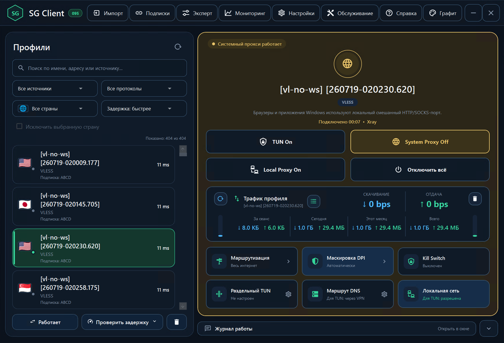

### Local Proxy

Локальный HTTP/SOCKS-прокси работает без изменения системных настроек Windows. Активное состояние выделяется фиолетовым.

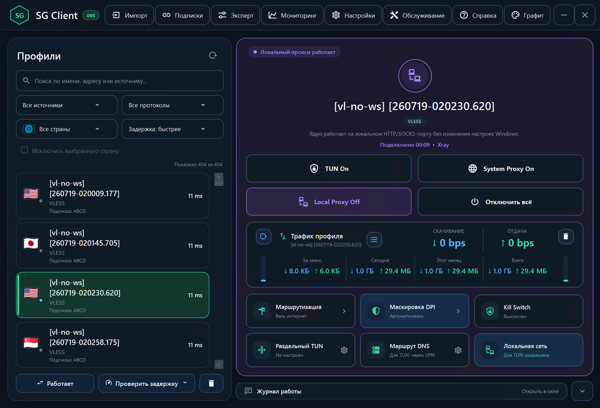

## Управление из системного трея

Главное окно можно не держать открытым. Из меню трея доступны:

- включение и отключение TUN;
- включение System Proxy;
- включение Local Proxy;
- команда **«Отключить всё»**;
- быстрый выбор профиля;
- проверка задержки текущего профиля;
- копирование адреса Local Proxy;
- открытие маршрутов и журнала;
- импорт ссылки из буфера обмена;
- открытие и завершение SG-Client.

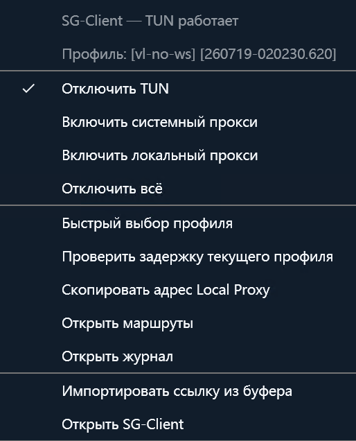

## Маршруты и соединения

Отдельное окно показывает фактические назначения Xray в реальном времени:

- страну, домен или IP;
- применённое правило;
- направление VPN, Direct или Block;
- TCP/UDP;
- количество обращений;
- время последней активности;
- поиск, фильтрацию и историю за 15 минут;
- экспорт в CSV и JSON.

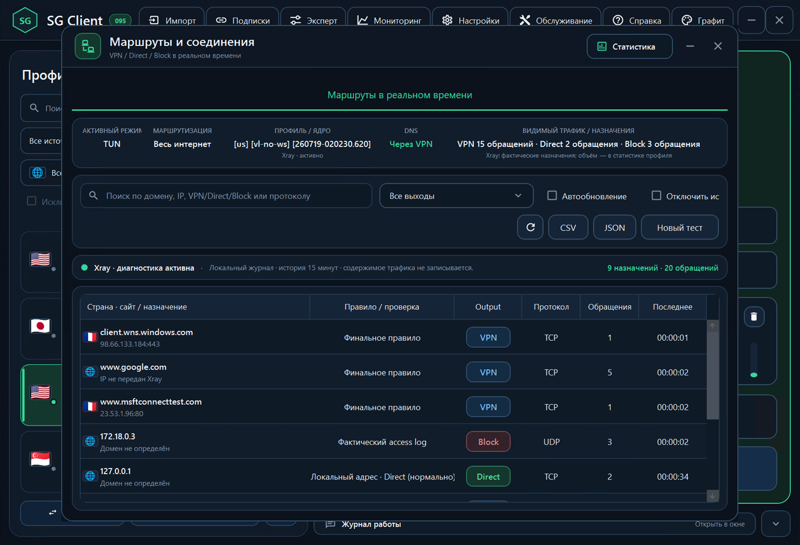

## Маршрутизация и GeoFiles

Правила маршрутизации применяются единообразно для Xray и sing-box. Доступны российские пресеты, пользовательские правила, локальная сеть, реклама и трекеры, заблокированные ресурсы и общий маршрут.

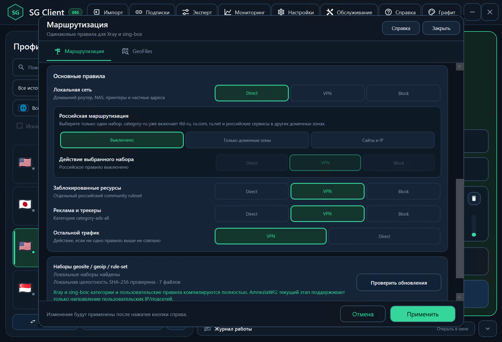

GeoFiles можно брать из комплекта SG-Client, Loyalsoldier, RunetFreedom, RoscomVPN, пользовательских URL или локальных файлов. Перед применением источник проверяется, а предыдущий комплект сохраняется для отката.

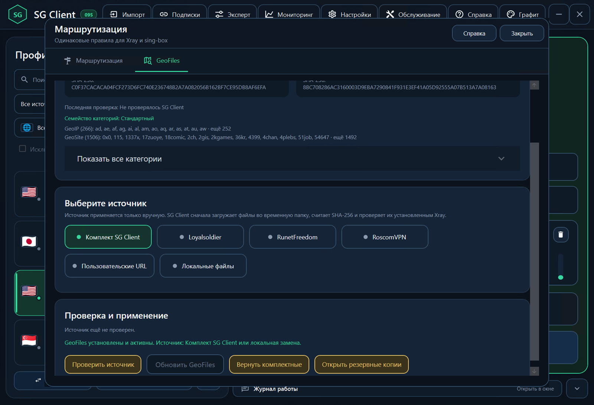

## Подписки

Подписки обновляются напрямую или через VPN. Новый список сначала загружается и проверяется; при ошибке прежние рабочие профили сохраняются.

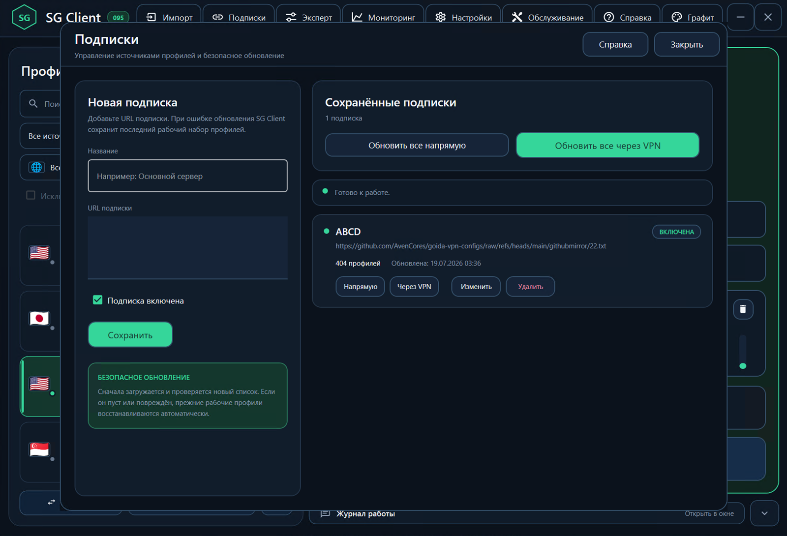

## Резервные копии и обновления

SG-Client сохраняет профили, подписки, настройки, маршрутизацию, статистику, журналы и локальные профили AmneziaWG. Перед восстановлением архив проверяется, а текущее состояние сохраняется отдельно.

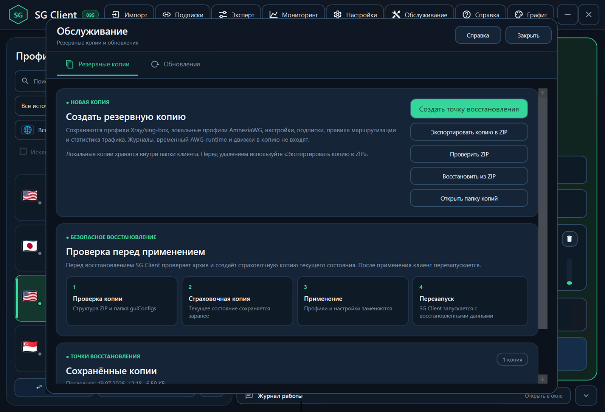

Ручное обновление Xray выполняется только после проверки выбранной версии, SHA-256 и совместимости текущего `config.json`.

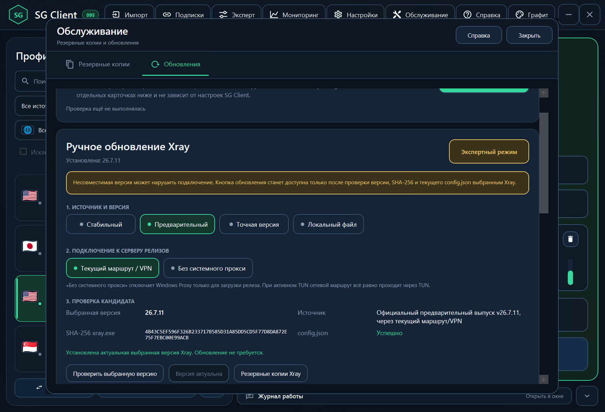

## Быстрый запуск

1. Скачайте `SG-CLIENT-095-PORTABLE-x64.zip` на странице Releases.
2. Полностью распакуйте архив в отдельную папку.
3. Запустите `SG-Client.exe` и подтвердите запрос прав администратора.
4. Импортируйте ссылку либо добавьте URL в разделе **Подписки**.
5. Выберите профиль и включите нужный режим.

Portable-архив не содержит пользовательских профилей, подписок, ключей, настроек, статистики или журналов.

## Встроенная справка

В SG-Client есть подробное руководство по режимам подключения, импорту, подпискам, маршрутизации, соединениям, GeoFiles, DPI, DNS, Kill Switch, раздельному TUN, локальной сети, AmneziaWG и экспертным настройкам.

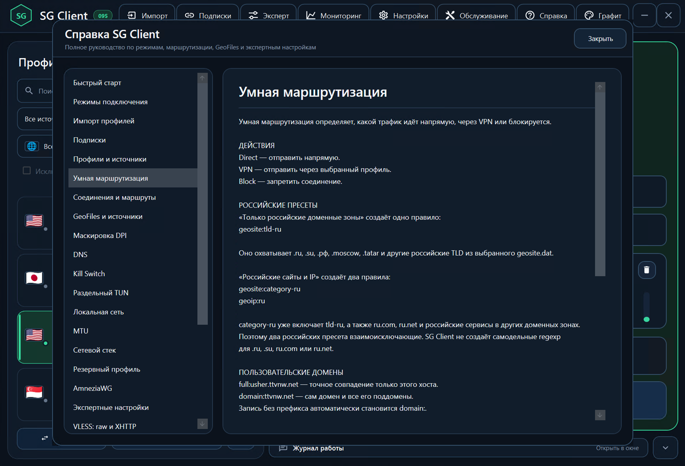

## Исходный код и лицензии

Исходный код версии 095 находится в каталоге `v2rayN`. Проект использует открытые компоненты v2rayN, Xray-core, sing-box, AmneziaWG, Wintun и открытые базы маршрутизации. Авторство и лицензии перечислены в [THIRD-PARTY-NOTICES.md](THIRD-PARTY-NOTICES.md).

Не публикуйте в Issues приватные ключи, UUID действующих профилей, токены, полные серверные конфигурации и неочищенные журналы.

Проект и интерфейс SG-Client: **Ser.Gor**.
