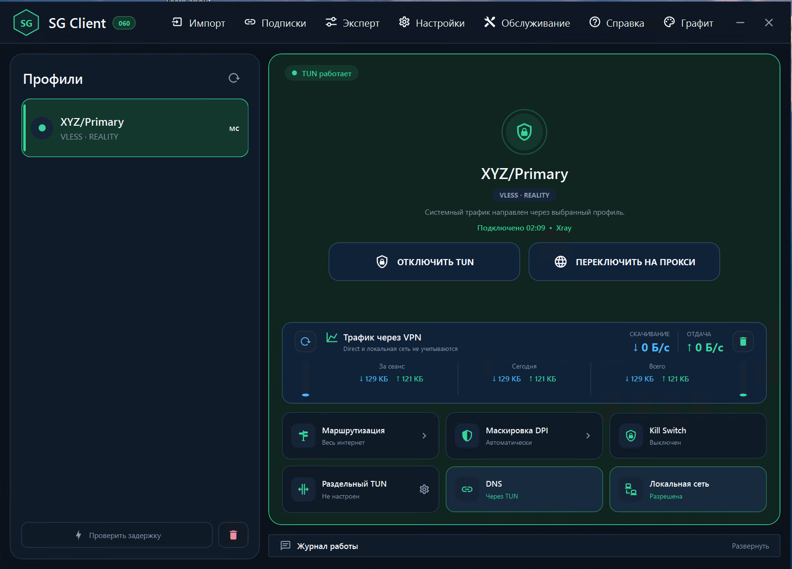
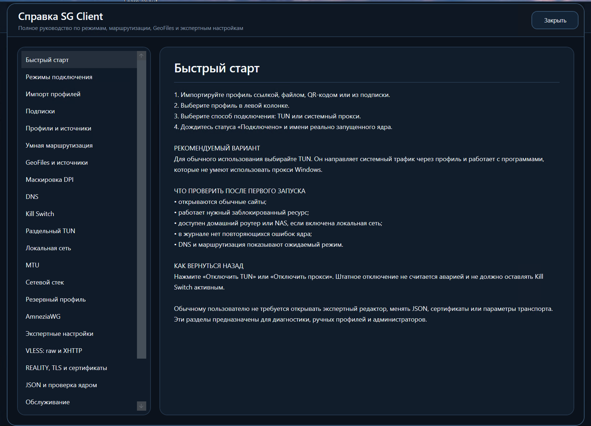

# SG Client

Единый Windows-клиент для профилей SG-Panel, SG-AWG-Panel и совместимых стандартных конфигураций.


> Текущая версия: `v0.0.60`. Официальный формат — компактный Portable ZIP для Windows x64.



## Скачать

### [Скачать SG Client 060 Portable x64](https://github.com/s-gor/sg-client-win/releases/download/v0.0.60/SG-CLIENT-060-PORTABLE-x64.zip)

Дополнительные файлы:

- [исходный код SG Client 060](https://github.com/s-gor/sg-client-win/releases/download/v0.0.60/SG-CLIENT-060-SOURCE.zip);
- [контрольные суммы SHA-256](https://github.com/s-gor/sg-client-win/releases/download/v0.0.60/SHA256SUMS.txt);
- [страница релиза v0.0.60](https://github.com/s-gor/sg-client-win/releases/tag/v0.0.60).

Установочный EXE не используется. Полностью распакуйте ZIP в отдельную папку и запускайте `SG-Client-060.exe` только из распакованной папки.

## Что такое SG Client

SG Client — единый Windows-клиент экосистемы SG. Он импортирует ссылки, подписки и конфигурации, выбирает подходящее сетевое ядро и предоставляет три режима подключения:

- TUN;
- системный прокси Windows;
- локальный HTTP/SOCKS-прокси.

```text
SG-Panel / SG-AWG-Panel / совместимый источник
                       |
                       | ссылка, подписка или конфигурация
                       v
                  SG Client 060
                       |
                       +-- Xray --------> VLESS / Hysteria2
                       +-- sing-box ----> Hysteria2
                       +-- AmneziaWG ---> AWG
                       |
                       v
                    Интернет
```

Движки изолированы: для каждого профиля используется только соответствующий ему компонент.

## Поддерживаемые профили

| Источник | Профиль | Движок |
|---|---|---|
| SG-Panel / совместимый источник | VLESS REALITY, TCP/RAW | Xray |
| SG-Panel / совместимый источник | VLESS XHTTP + REALITY | Xray |
| SG-Panel / совместимый источник | VLESS XHTTP + TLS | Xray |
| SG-Panel / совместимый источник | Hysteria2 + TLS | Xray или sing-box |
| SG-AWG-Panel / `.conf` | AmneziaWG | AmneziaWG |

Стандартные ссылки и конфигурации других панелей также могут работать, если они используют поддерживаемые форматы и параметры.

## Что нового в 060

- три режима подключения с переключением прямо на главном экране;
- подписки с безопасным обновлением профилей;
- просмотр и редактирование фактических DNS-конфигураций Xray и sing-box;
- отдельная вкладка GeoFiles с несколькими источниками;
- безопасное обновление Xray и sing-box с резервной копией и автоматическим откатом;
- экспертный редактор профилей и проверка итогового `config.json` выбранным ядром;
- расширенная русская справка;
- обновлённый интерфейс, цветовые сцены режимов и DPI-корректные размеры окон.

Полный список: [Release Notes 060](RELEASE-NOTES-060.md).

## Быстрый запуск

1. [Скачайте Portable ZIP](https://github.com/s-gor/sg-client-win/releases/download/v0.0.60/SG-CLIENT-060-PORTABLE-x64.zip).
2. Полностью распакуйте архив, например в `D:\Programs\SG-Client-060`.
3. Запустите `SG-Client-060.exe`.
4. Подтвердите запрос Windows на запуск с правами администратора.
5. Импортируйте ссылку, подписку или конфигурацию.
6. Выберите профиль.
7. Включите TUN или системный прокси.
8. Дождитесь состояния «Подключено» и проверьте доступ в интернет.

Не запускайте программу непосредственно из ZIP-архива.

## Основные функции

### Три режима подключения

**TUN** направляет системный трафик Windows через активный профиль и подходит для программ без поддержки прокси.

**Системный прокси Windows** запускает локальный HTTP/SOCKS-прокси и применяет его в настройках Windows.

**Локальный HTTP/SOCKS-прокси** запускает порты без изменения настроек Windows — нужные программы настраиваются вручную.

### Умная маршрутизация

Для категорий можно выбрать `Direct`, `VPN` или `Block`. Доступны готовые схемы и пользовательская настройка.

### DNS

SG Client показывает фактически используемые конфигурации Xray и sing-box отдельно для обычного режима и TUN. Ручное редактирование начинается с текущего рабочего JSON и требует проверки.

### GeoFiles

Отдельная вкладка поддерживает:

- комплект SG Client;
- Loyalsoldier;
- RunetFreedom;
- пользовательские URL;
- локальные `geoip.dat` и `geosite.dat`.

Перед заменой показываются размер, дата и SHA-256. Файлы проверяются установленным Xray, создаётся резервная копия, при ошибке выполняется автоматический откат.

### Маскировка DPI

Для поддерживаемых Xray-профилей доступны автоматический режим, дробление TLS/ClientHello и экспериментальный режим с шумом. Для Hysteria2 обычное Xray-дробление не применяется. Параметры AmneziaWG берутся из профиля.

### Kill Switch

Kill Switch защищает от выхода трафика в обход TUN при аварийном разрыве. Перед включением ознакомьтесь со встроенной справкой и способом восстановления сети.

### Экспертные настройки

Экспертный раздел предназначен для диагностики, локальных копий и нестандартных конфигураций. Он включает редактор профиля, DNS JSON, локальный прокси, проверку полного конфига выбранным ядром и сведения об источнике параметров.

### Обслуживание

В разделе обслуживания доступны резервные копии, восстановление, обновление Xray и sing-box, проверка SHA-256, тест текущего конфига и управление GeoFiles.

## Документация

### Начало работы

- [С чего начать](docs/START-HERE.md)
- [Полное руководство пользователя](docs/USER-GUIDE.md)
- [Portable: скачивание и запуск](docs/PORTABLE.md)

### Профили и подключение

- [Импорт профилей и подписок](docs/IMPORT-PROFILES.md)
- [Состояния подключения и проверка работы](docs/CONNECTION-CHECK.md)
- [Экспертные настройки](docs/EXPERT-SETTINGS.md)

### Сеть и защита

- [TUN, Proxy, DNS и маршрутизация](docs/TUN-ROUTING-DNS.md)
- [GeoFiles и источники](docs/GEOFILES.md)
- [Маскировка DPI](docs/DPI.md)
- [Kill Switch и аварийное восстановление](docs/KILL-SWITCH.md)

### Обслуживание

- [Диагностика](docs/DIAGNOSTICS.md)
- [Обновления компонентов](docs/UPDATES.md)
- [Release Notes 060](RELEASE-NOTES-060.md)

## Состав Portable

В официальный пакет входят:

- `SG-Client-060.exe`;
- Xray-core;
- sing-box и `libcronet.dll`;
- AmneziaWG, `awg.exe` и Wintun;
- `geoip.dat`, `geosite.dat` и SRS-наборы;
- обязательные библиотеки .NET/WPF;
- документация и сведения о сторонних компонентах.

Пакет не содержит пользовательских профилей, подписок, журналов, статистики, резервных копий, временных файлов и результатов сборки.

## Интерфейс SG Client 060

### Главное окно

Главный экран показывает активный профиль, ядро, режим подключения, время соединения, скорость и трафик. Здесь же доступны маршрутизация, DPI, Kill Switch, DNS, разделённый TUN и локальная сеть.


### Встроенная справка

Справка подробно описывает режимы подключения, GeoFiles, DNS, MTU, маршрутизацию, обслуживание и экспертные параметры.



## Требования

- Windows 10 или Windows 11 x64;
- права администратора для TUN, маршрутов и Kill Switch;
- полная распаковка Portable;
- поддерживаемая ссылка, подписка или конфигурация.

## Лицензии

Проект использует Xray-core, sing-box, AmneziaWG, Wintun, инфраструктуру на основе v2rayN и открытые базы маршрутизации. Уведомления находятся в `THIRD-PARTY-NOTICES.md` и внутри Portable.

## Ответственность

Используйте SG Client в соответствии с законодательством своей страны, правилами сети и условиями провайдера. Перед включением Kill Switch убедитесь, что знаете способ аварийного восстановления.

Проект: **Ser.Gor**.
