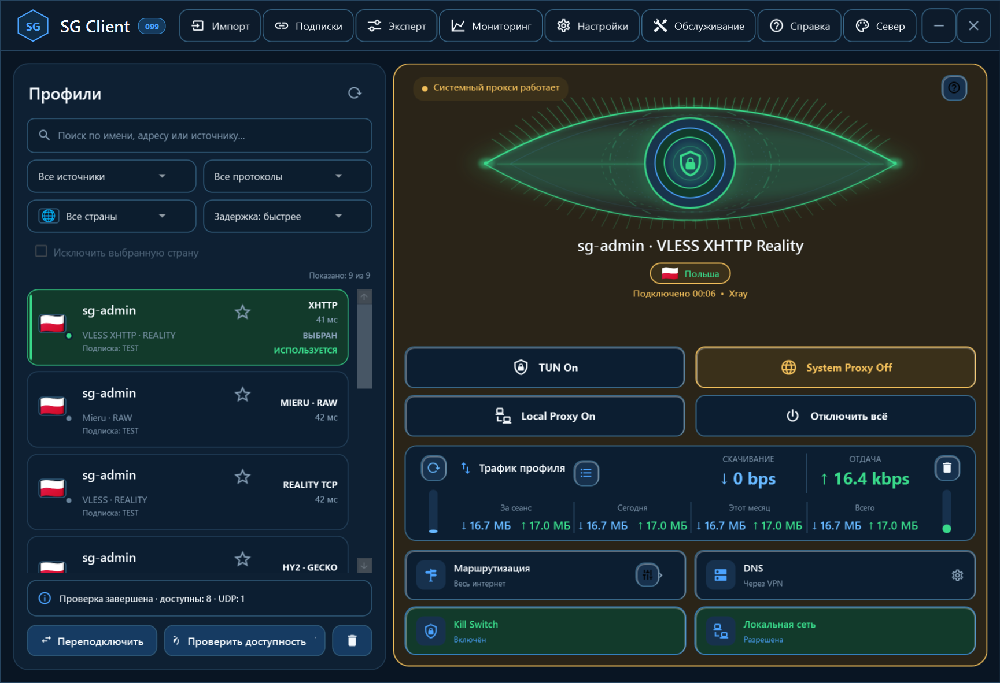
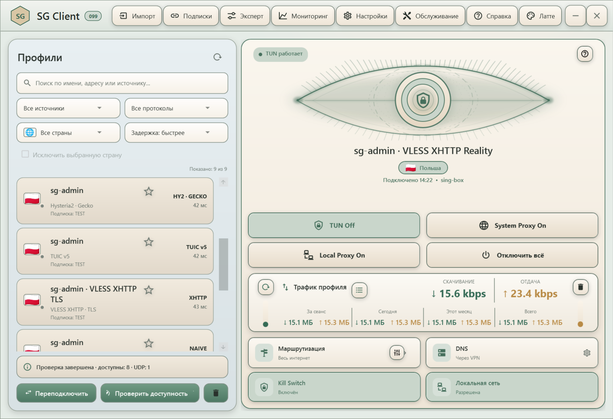
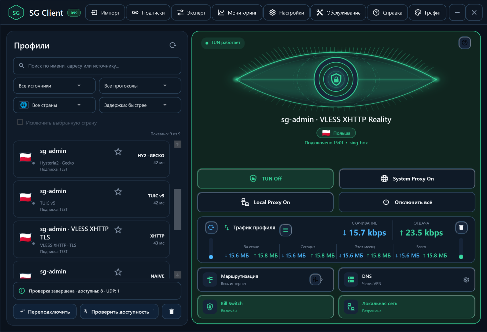
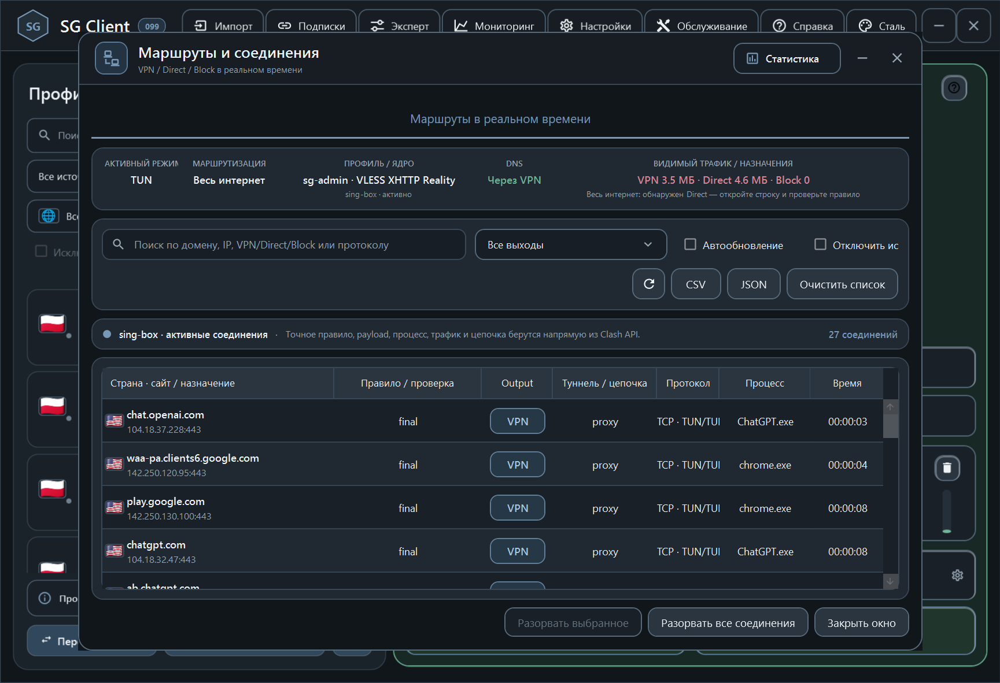
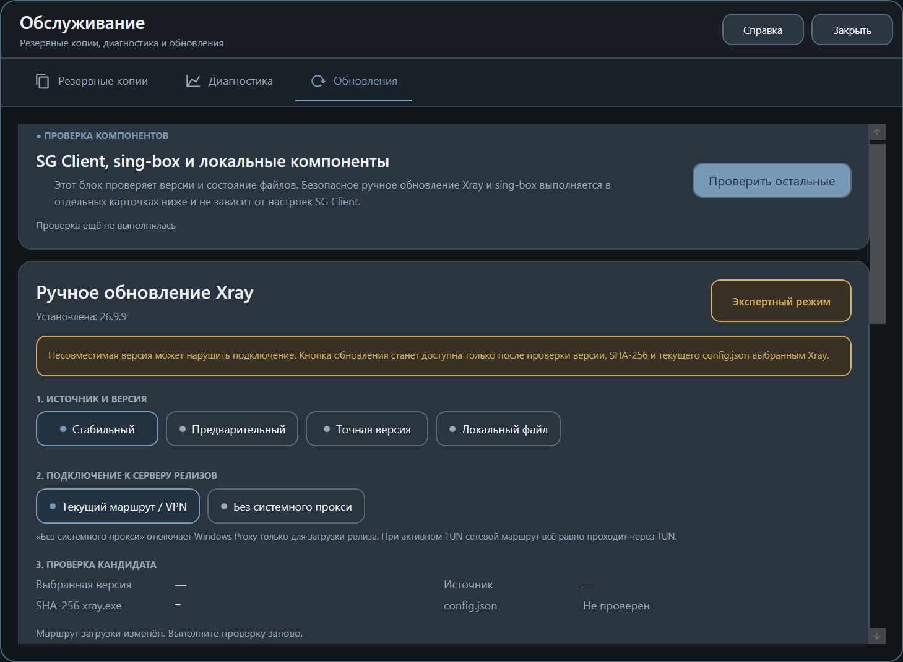
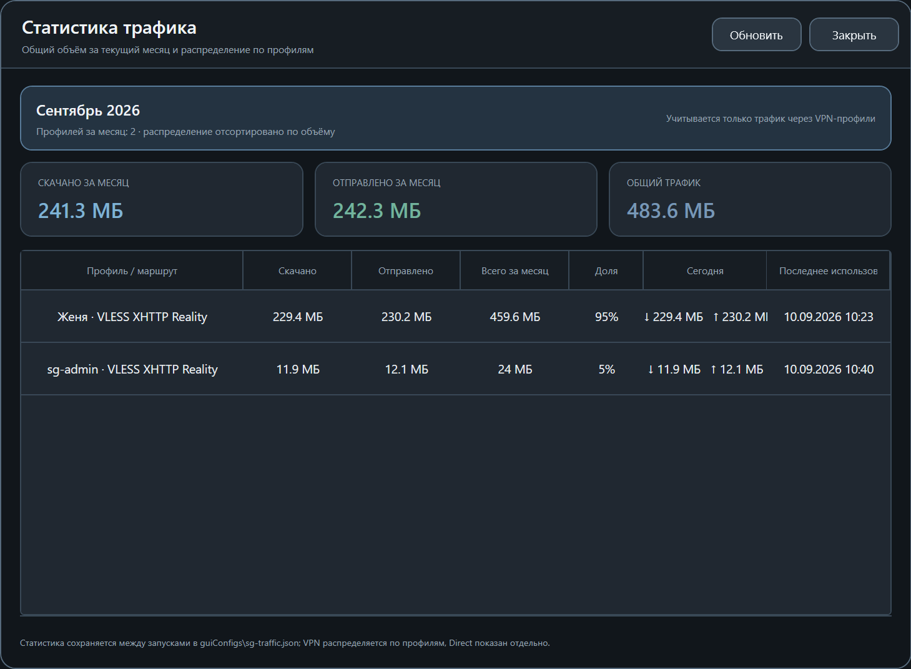
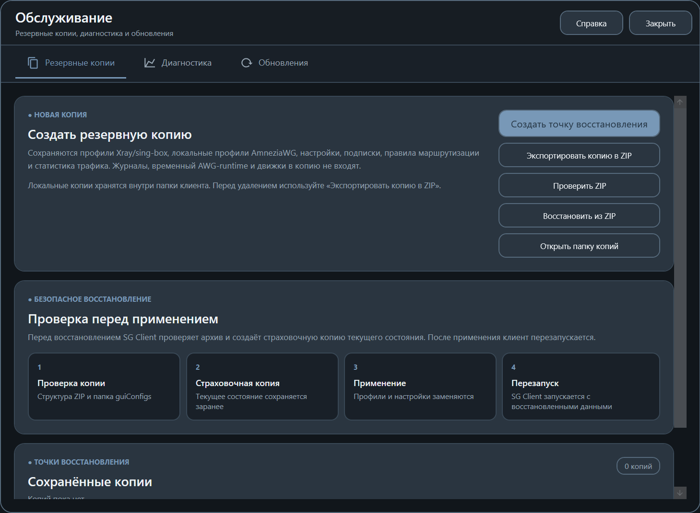

# SG Client 099

  <strong>Windows-клиент SG для современных VPN и proxy-подключений</strong>

  
  
  

---

## Скачать

Финальная публикационная сборка:

`SG-CLIENT-099-PORTABLE-x64-FINAL.zip`

> Portable не требует установки. Распакуйте ZIP в отдельную папку и запустите `SG-Client.exe`.

**SHA-256:**

`476d1aa96a9fb6c6b385a9169e092dc74c49bf69d950890e65a3e308a62de6e5`

**Страница релизов:** https://github.com/s-gor/sg-client-win/releases

---

## SG Client 0.0.099

**SG Client** — единый Windows-клиент для защищённых VPN и proxy-подключений с несколькими сетевыми движками, TUN-режимом, маршрутизацией, диагностикой и единым интерфейсом.

Релиз **099** — крупное обновление после 096. Основные изменения затрагивают Xray, AmneziaWG 2.0/3.0/3.1, современные протоколы, DNS, Kill Switch, проверку серверов, статистику и Portable-сборку.

---

## Главное в 099

### Xray

- актуальное ядро Xray;
- VLESS / REALITY / TLS / XHTTP;
- TUN и пользовательская маршрутизация;
- Hysteria 2 и совместимые сценарии.

### AmneziaWG 2.0 / 3.0 / 3.1

AmneziaWG 2.0, 3.0 и 3.1 поддерживаются как отдельные профили и могут одновременно присутствовать в одном клиенте.

- ручной импорт и SG-подписки;
- корректное обновление профилей без дублей;
- AWG 3.1 в TUN-режиме, включая DNS и UDP/QUIC;
- исправлен переход между обычными профилями и AWG;
- интерфейс и статистика показывают фактически активное подключение.

> **Важно для AWG 3.1:** при первом запуске Windows может показать запрос брандмауэра для `sing-box.exe`. Нужно нажать **«Разрешить доступ»** — без этого AWG 3.1 может не подключиться. SG Client показывает отдельное предупреждение перед первым запуском; информация также есть в разделе помощи AmneziaWG.

### DNS для разных сетей

На странице DNS добавлены готовые сценарии с парой **основной + резервный** для Direct, Remote и Bootstrap DNS.

- **SG Auto · Россия** — рекомендуемый сценарий;
- **Smart DNS · Россия** — `111.88.96.50 / 111.88.96.51`;
- Cloudflare, Google, Quad9, AdGuard, Яндекс, DNSPod;
- DNS по TCP;
- прямой DNS;
- режим **«Свой»** при ручном редактировании;
- встроенная проверка UDP / TCP / DoH.

Для российских сценариев клиент не полагается на `1.1.1.1` и `8.8.8.8` как на обязательный Direct/Bootstrap по умолчанию.

### Современные протоколы

- Mieru TCP/UDP;
- NaiveProxy;
- TUIC v5 / QUIC;
- AnyTLS;
- Hysteria 2;
- Mihomo v1.19.30.

Для Mihomo добавлено безопасное обновление с проверкой SHA-256, резервной копией предыдущего ядра, проверкой нового ядра и автоматическим rollback при ошибке.

### Ads=Block

Для AWG блокировка рекламы переработана: правила участвуют не только в DNS-фильтрации, но и в обработке реального трафика в TUN-режиме.

### Проверка задержки

Реальная проверка задержки работает и для профилей, которые нельзя нормально оценить обычным TCP-connect, включая Mieru TCP/UDP, TUIC v5, AnyTLS и AmneziaWG.

### Маршрутизация и RU White List

- RU White List для основных движков и AWG;
- выборочный Direct;
- пользовательские правила;
- корректная обработка IPv4/IPv6 CIDR;
- диагностика текущих маршрутов и соединений.

### Kill Switch

- включён по умолчанию на новых установках;
- сохранённый выбор пользователя не перезаписывается;
- «Отключить всё» не отключает саму настройку Kill Switch;
- временная firewall-блокировка корректно снимается при полном отключении.

### Активное подключение и статистика

- отображается реально работающий профиль и протокол;
- устранено «залипание» предыдущего подключения;
- трафик относится к фактически активному профилю;
- после полного отключения выбранный профиль и накопленная статистика сохраняются.

---

## Скриншоты

Оригинальные PNG из финальной сборки. Файлы загружены без изменения разрешения, crop, перекодирования или дополнительного сжатия.

### Главный экран — актуальный Xray

### Светлая тема

### Тёмная тема

### Маршруты и активные соединения

### Обновление ядра

### Статистика профиля

### Резервное копирование и восстановление

---

## Быстрый старт

1. Скачайте Portable ZIP со страницы Releases.
2. Распакуйте архив в новую папку.
3. Запустите `SG-Client.exe`.
4. Импортируйте ссылку или профиль.
5. Выберите режим подключения.
6. Нажмите **Подключить**.
7. При первом запуске AWG 3.1 разрешите доступ `sing-box.exe` в брандмауэре Windows.

---

## Portable и контроль сборки

Публичная сборка 099 распространяется только как готовый **Portable ZIP для Windows x64**.

Portable очищен от пользовательских профилей, локальной БД, журналов, временных конфигураций, резервных копий и другого локального состояния. При подготовке проверены обязательные runtime-компоненты и ZIP CRC.

**Файл:** `SG-CLIENT-099-PORTABLE-x64-FINAL.zip`

**SHA-256:** `476d1aa96a9fb6c6b385a9169e092dc74c49bf69d950890e65a3e308a62de6e5`

---

## Конфиденциальность

Публичный Portable не содержит пользовательские профили, UUID, токены, subscription URL, рабочие конфигурации, журналы, резервные копии и локальную историю трафика.

---

## Подробности релиза

[RELEASE-NOTES-099.md](RELEASE-NOTES-099.md)

---

  <strong>SG Client 0.0.099</strong> 
  Windows · Portable · Xray · Mihomo · Mieru · AmneziaWG 2.0 / 3.0 / 3.1

