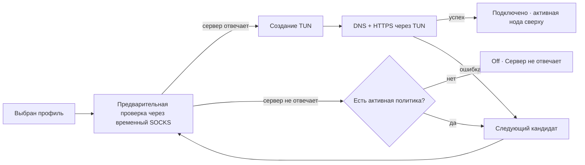

# SG Client 099K

<p align="center">
  <strong>Windows-клиент SG с проверкой реального доступа, SMART-политиками и автоматическим резервированием</strong>
</p>

<p align="center">
  
  
  
  
</p>

> [!IMPORTANT]
> Ветка `release/099k` содержит оформление release candidate. Готовый Portable будет опубликован только после чистой Windows-сборки, запуска тестов и проверки итогового архива.

## Что изменилось в 099K

SG Client больше не считает запущенное ядро или появившийся TUN доказательством рабочего VPN. Обычная нода сначала проходит короткую предварительную проверку без системного TUN. Затем созданный туннель подтверждается реальными DNS- и HTTPS-запросами.


```mermaid
flowchart LR
    A[Выбран профиль] --> B[Предварительная проверка через временный SOCKS]
    B -->|сервер отвечает| C[Создание TUN]
    B -->|сервер не отвечает| D{Есть активная политика?}
    D -->|нет| E[Off · Сервер не отвечает]
    D -->|да| F[Следующий кандидат]
    F --> B
    C --> G[DNS + HTTPS через TUN]
    G -->|успех| H[Подключено · активная нода сверху]
    G -->|ошибка| F
```

Для AmneziaWG применяется отдельный строгий путь: запуск службы, handshake, DNS и HTTPS. Ложный зелёный статус недопустим.

## Основные возможности

| Область | Что доступно в 099K |
|---|---|
| Подключение | Предварительная проверка сервера до создания TUN; строгая DNS + HTTPS проверка после запуска |
| Failover | Именованные политики, конкретные профили и группы протоколов, cooldown, лимит переходов, возврат на основной профиль |
| SMART | Отдельная логика для SG-подписок и обычных подписок |
| Видимость | После failover рабочая нода становится первой, выделяется и прокручивается в видимую область |
| Сортировка | Исходный порядок, задержка, название, источник, протокол и страна |
| Безопасность | Kill Switch во время проверки и переключения; повторяемая аварийная команда «Отключить всё» |
| AmneziaWG | Независимая поддержка AWG 2.0, AWG 3.0 и AWG 3.1 |
| Интерфейс | Пошаговый мастер политик, понятный редактор, компактная индикация задержки, пять тем |
| Профили | Множественный выбор и пакетное удаление профилей и нод |
| Импорт | Новый AWG-профиль выделяется для следующего подключения; текущее соединение не прерывается |

## Что вошло в FIX9–FIX14

- **FIX9:** аварийное отключение больше не блокируется зависшей операцией; накладка задержки стала компактнее.
- **FIX10:** восстановлена сортировка во всех режимах; быстрые ответившие ноды поднимаются во время проверки.
- **FIX11:** обычный сервер проверяется до создания системного TUN; политика перебирает кандидатов без создания нерабочих туннелей.
- **FIX12:** фактически подключённая нода поднимается на первое место и становится видимой после ручного подключения или failover.
- **FIX13:** переработан редактор политик: русские подписи, явная активная политика, предупреждения, видимый порядок и переход к профилям после сохранения.
- **FIX14:** импортированный AWG-профиль становится целью следующего подключения, не разрывая уже работающую ноду; кнопка использует зафиксированный ID выбранной строки.

## Документация

- [Полное описание релиза](RELEASE-NOTES-099K.md)
- [Политики, шаблоны, SMART и failover](docs/099K-POLICIES-GUIDE.md)
- [Исправления FIX9–FIX13](docs/099K-FIX9-FIX13-GUIDE.md)
- [Импорт и переключение на новый профиль — FIX14](docs/099K-IMPORT-SELECTION-GUIDE.md)
- [Проверка задержки](docs/099K-LATENCY-GUIDE.md)
- [Темы «Пепел» и «Сталь»](docs/099K-THEMES-GUIDE.md)
- [Чек-лист публикации](docs/099K-RELEASE-CHECKLIST.md)

## Release candidate FIX14

Исходно-сборочный пакет:

```text
SG-CLIENT-099K-STEP-WIZARD-CMD-FIX14.zip
SHA-256: 220d3c18c8b36a2f7c1a3679345580ab5429a1b5088c89b4bba672f860f8da71
Размер: 104 393 426 байт
```

Проверка самого ZIP подтверждает:

- 892 файла;
- 891 запись SHA-256 в манифесте;
- 0 ошибок манифеста;
- 0 ошибок CRC;
- 0 дубликатов путей;
- 0 небезопасных путей.

> [!NOTE]
> Это пакет для сборки на Windows, а не готовый Portable. Он запускается через `START-099K.cmd`. Компиляция WPF и фактические сетевые сценарии должны быть подтверждены на Windows до публикации Release.

## Поддерживаемые движки и режимы

- Xray
- sing-box
- Mihomo
- Mieru
- AmneziaWG 2.0 / 3.0 / 3.1
- Wintun
- TUN Mode
- System Proxy
- Local Proxy

## Конфиденциальность публикации

Публичный Portable не должен содержать профили, UUID, токены, URL подписок, рабочие конфигурации, журналы, резервные копии или локальную историю трафика.

---

<p align="center">
  <strong>SG Client 099K</strong><br>
  Windows · Preflight · Verified TUN · Failover · SMART · AWG 3.1
</p>
